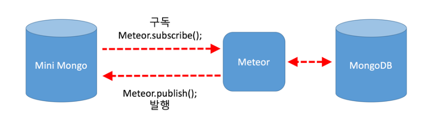

# 미티어 에 대하여

## 미티어 란?

미티어의 특징
미티어는 브라우저 / 서버 / 데이터베이스에 이르기까지 자바스크립트로 구성된 풀스텍 플랫폼으로 커맨드라인 한 줄만으로 빠르게 개발 환경을 구성할수 있는 풀스텍 자바스크립트 플랫폼이다. 미티어의 특징을 살펴 보면 아래와 같다.

빠른 개발환경 구성 : 미티어는 커맨드라인에서 입력하는 한 줄의 프로젝트 생성 명령 만으로 브라우저/서버/데이터베이스 까지 개발 환경 구성이 한번에 끝난다. 내장된 몽고디비(www.mongodb.com)는 JSON(JavaScript Object Notation, www.json.org)을 저장하는 데이터베이스로 요즘 주목 받고 있는 NoSQL 데이터베이스 중 하나이다. 실시간 데이터 동기화
발행/구독(publish/subscribe)이라는 구조로 브라우저와 서버 간의 데이터 교환이 실시간으로 이루어진다. 따라서 채팅,sns 같은 실시간이 필요한 애플리케이션을 쉽게 작성할 수 있다. 짧은 코드로 말이다. 
풀스택 자바스크립트 클라이언트와 서버를 지나 데이터베이스에 이르기까지 모두 자바스크립트만으로 구현한다. 데이터는 클라이언트에서 작성된 데이터 포멧을 몽고디비까지 같은 형태로 저장이 가능하다. 그야말로 풀스택 자바 스크립트 플렛폼이다. 모바일 통합 개발환경 미티어에서 개발한 앱은 데스크탑 뿐만 아니라 Android, iOS에서 사용 할 수 있는 패키지로 배포 할 수 있다. 특히 모바일 환경은 내장된 코드로바(http://cordova.apache.org/)를 통하여 하이브리드 앱 형태로 배포하므로 별도의 컴파일 환경을 구축할 필요가 없이 미티어 만으로 앱 제작이 가능하다. 풍부한 패키지 미티어는 프레임워크가 아니며, atmosphere(http://atmosphere.meteor.com)라는 미티어 패키지 저장소가 존재한다. 여기서 여러분이 좋아하는 프레임워크들을 프론트 부터 백엔드 까지 골라서 사용 할수 있다.

기본적으로 내부의 mongo DB 를 사용하지만 사용에 따라 외부 mysql, mongo DB를 사용할 수 있다.

참고 http://webframeworks.kr/getstarted/meteorjs/


#### 1. 설치하기

window 패키지 관리 소프트웨어인 Chocolatey 를 다운로드 후 
		(관리자 권한으로 cmd를 열어 @"%SystemRoot%\System32\WindowsPowerShell\v1.0\powershell.exe" -NoProfile -InputFormat None -ExecutionPolicy Bypass -Command "iex ((New-Object System.Net.WebClient).DownloadString('https://chocolatey.org/install.ps1'))" && SET "PATH=%PATH%;%ALLUSERSPROFILE%\chocolatey\bin" 를 입력시 다운로드가 진행 된다 .)
		choco install meteor 실행으로 미티어 다운로드 (리눅스 인 경우 "curl https://install.meteor.com/ | sh" 명령어로 다운)
		js 기반이기 때문에 설치가 가볍다X 쉽다.


#### 2. 시작하기

meteor를 설치 후 meteor create 프로젝트명 (프로젝트 생성)-> meteor run (실행) 미티어가 실행 되는데
		실행 메시지를 보면 내부프록시 -> 몽고DB -> App 순으로 시작된다.
		프로젝트 위치에서 meteor mongo 를 치면 mongo db 를 볼 수 있다. 

기본 설치시
		.meteor (빌드 파일 위치)
		client (클라이언트 소스)
		node_modules (node 패키지 위치)
		server (서버 소스 위치)
		package.json
		로 구성되는데 
		소스 작성은 client, server가 주를 이룬다.

#### 3. 기본 소스 설명
```javascript

client main.html

//<template name="hello"> 이 {{> hello}}에 들어간다 템플릿 내에 {{counter}} 는 js에서 선언한 변수
<head>
  <title>meteorApp</title>
</head>

<body>
  <h1>Welcome to Meteor!</h1>

  {{> hello}}
  {{> info}}
</body>

<template name="hello">
  <button>Click Me</button>
  <p>You've pressed the button {{counter}} times.</p>
</template>

<template name="info">
  <h2>Learn Meteor!</h2>
  <ul>
    <li><a href="https://www.meteor.com/try" target="_blank">Do the Tutorial</a></li>
    <li><a href="http://guide.meteor.com" target="_blank">Follow the Guide</a></li>
    <li><a href="https://docs.meteor.com" target="_blank">Read the Docs</a></li>
    <li><a href="https://forums.meteor.com" target="_blank">Discussions</a></li>
  </ul>
</template>


client main.js

//import
import { Template } from 'meteor/templating';
import { ReactiveVar } from 'meteor/reactive-var';

import './main.html';

// Template.hello는 html에서 어떤 template에서 동작하는지 지정.
// 이벤트 함수는 onCreated, onRendered, onDestroyed 등이 있다
// helpers는 변수 전달 역할 event는 클라이언트와 서버간의 이벤트 전송
Template.hello.onCreated(function helloOnCreated() {
  // counter starts at 0
  this.counter = new ReactiveVar(0);
});

Template.hello.helpers({
  counter() {
    return Template.instance().counter.get();
  },
});

Template.hello.events({
  'click button'(event, instance) {
    // increment the counter when button is clicked
    instance.counter.set(instance.counter.get() + 1);
  },
});


server main.js

import { Meteor } from 'meteor/meteor';

Meteor.startup(() => {
  // code to run on server at startup
});


```

#### 4. 게시판
```javascript

borderCollection = new Mongo.Collection("border");

Template.border.helpers({
  list() {
    return borderCollection.find();
  },
});

// tmpl으로 html 오브젝트를 찾을 수 있다.
Template.border.events({
    "click button[name=remove]" : function(evt , tmpl){
        borderCollection.remove({_id:this._id});
    }
});

// 게시판 insert 
Template.borderInsert.events({
    "click button[name=insert]" : function(evt , tmpl){

    	var noVal = tmpl.find("input[name=no]").value;
    	var nameVal = tmpl.find("input[name=name]").value;
    	var emailVal = tmpl.find("input[name=email]").value;
        
        borderCollection.insert({no: noVal, name: nameVal, email: emailVal});
        //borderCollection.remove({_id:this._id});
    }
});


```
#### 5. 프로젝트의 문제점

mongDB를 사용하는데 호출하는 부분이 client인데
이게 mongDB를 서버에서 사용한다고는 하지만 클라이언트측의 mini mongoDB를 사용하여
서버에서 클라이언트측과 내부적으로 구독(클라 -> 서버 요청)/발행(서버->클라 데이터 전송)하여 sync를 맞추기때문인데 현재까지 소스에서는 구독/발행 하는 소스가 없었는데 되는 이유는 autopublish 패키지가 자동으로 되어 있어 구독/발행이 자동으로 이루어진 것이다. 자동으로 이루어지기 때문에 서버측 mongoDB의 데이터 전부가 클라이언트 mini mongoDB로 전송되기 때문에 이는 보안으로 엄청난 문제이다.
따라서 autopublish를 삭제하고 수동으로 관리를 해야한다.
meteor list (autopublish 존재 확인)-> meteor remove autopublish (autopublish 삭제)




#### 6. 수정소스

```javascript 
client js 추가

//구독 소스 insert나 remove에 대해선 따로 구현이 필요없음.
Template.border.onCreated(function () {
    this.subscribe("borderCollection",{});
});


server js

//발행 소스
//obj 조건으로 주어 전체 데이터가 아닌 페이지에 보여줄 데이터만 client에 전한다 
Meteor.publish("borderCollection",function(obj){
    var condition = obj || {};
    
    return borderCollection.find(condition);
});
```