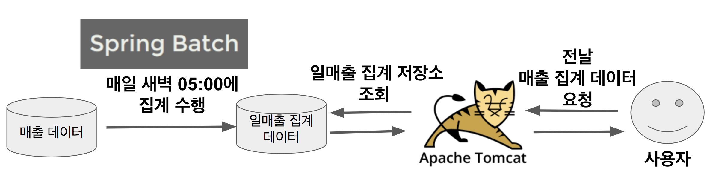
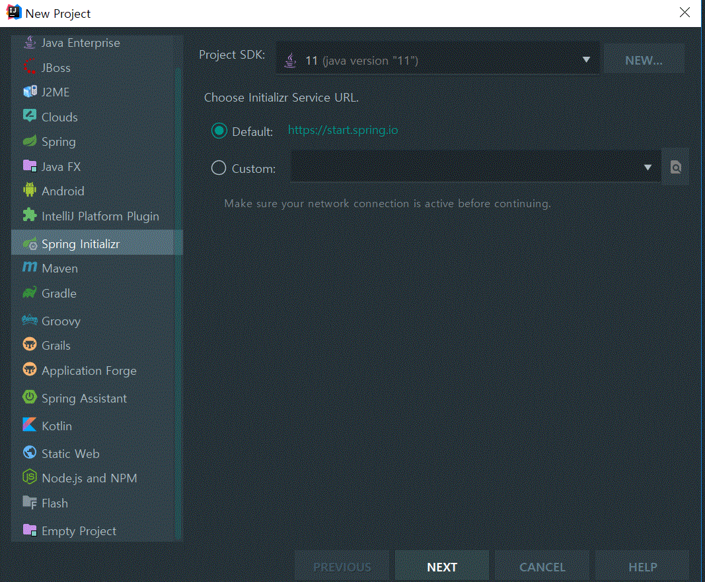
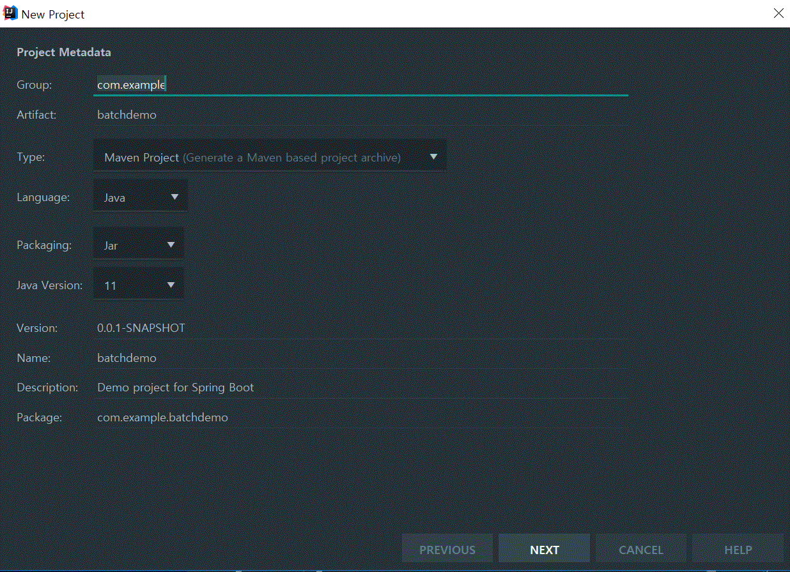
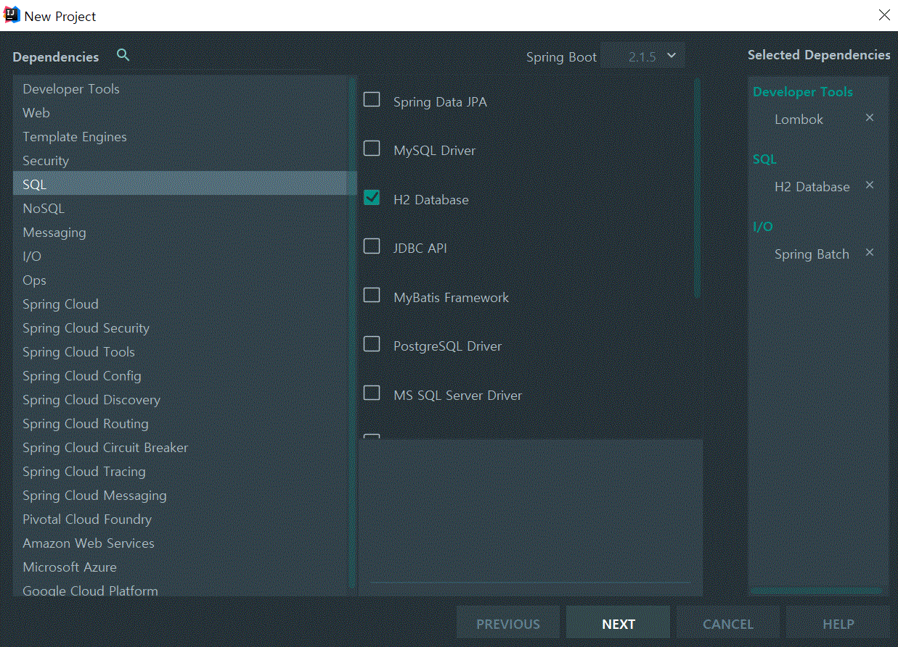
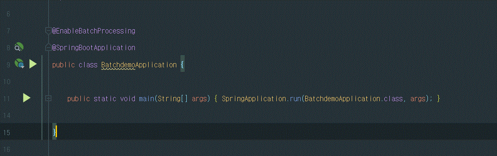
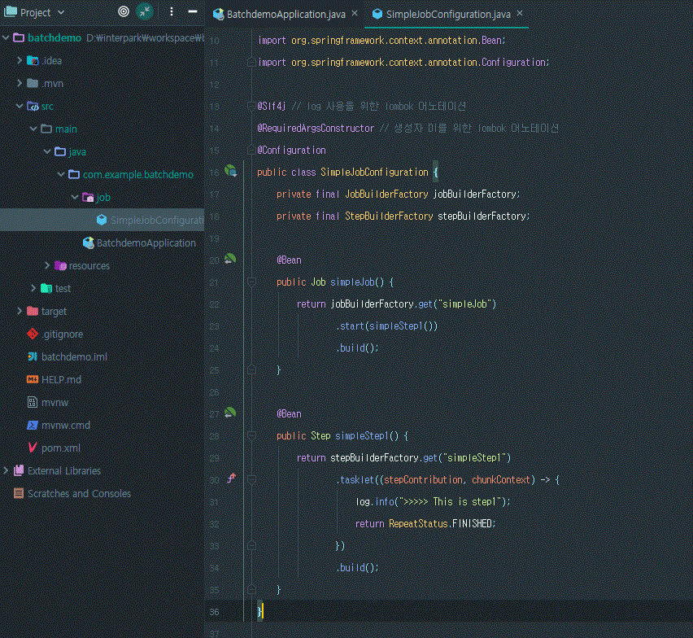
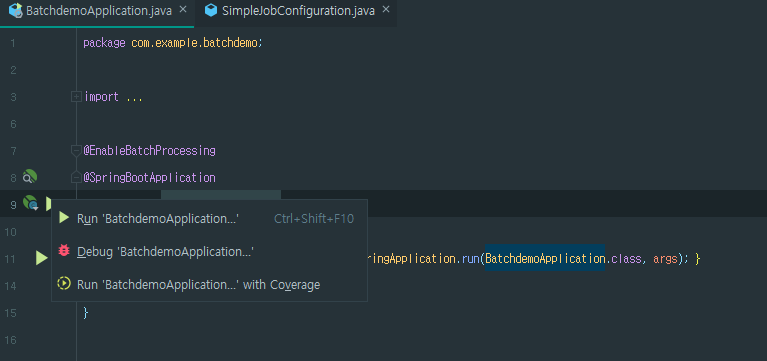
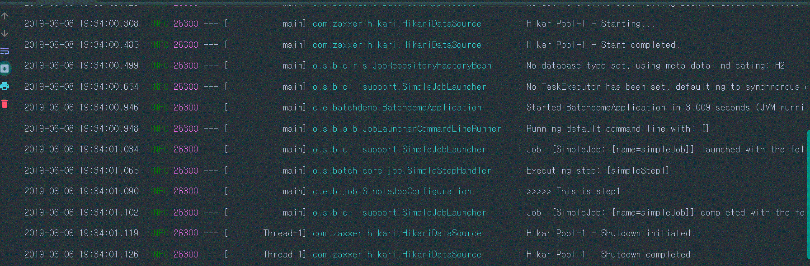

# 스프링 배치

## Batch(배치) 어플리케이션이란?
```
 배치(Batch)는 일괄처리란 뜻을 갖고 있습니다.
```
만약 매일 전 날의 데이터를 집계 해야한다고 가정해보겠습니다.
이 집계 과정을 어디서 수행하면 좋을까요?
웹 어플리케이션 밖에 모른다면 Tomcat + Spring MVC를 떠올리실것 같습니다. 
하지만 이렇게 큰 데이터를 읽고, 가공하고, 저장한다면 해당 서버는 순식간에 CPU, I/O 등의 자원을 다 써버려서 다른 Request 처리를 못하게 됩니다.

그리고 이 집계 기능은 **하루에 1번 수행**됩니다.
이를 위해 API를 구성하는 것은 너무 낭비가 아닐까요? 
여기서 추가로 데이터가 너무 많아서 처리중에 실패가 나면 어떻게 될까요? 
5만번째에서 실패했다면, 5만 1번째부터 다시 실행할 수 있다면 얼마나 좋을까요?

또 이런 경우도 있을수 있습니다. 
오늘 아침 누군가가 집계 함수를 실행시켰는데, 다른 누군가가 또 실행시켜 집계 데이터가 2배로 뻥튀기 될 수도 있습니다. 
같은 파라미터로 같은 함수를 실행할 경우 이미 실행한 적이 있어 실패하는 기능을 지원한다면 얼마나 좋을까요?

바로 이런 단발성으로 대용량의 데이터를 처리하는 어플리케이션을 배치 어플리케이션이라고 합니다. 

Spring 진영에선 **Spring Batch**가 있습니다.

Spring Batch를 소개하기전에 배치 어플리케이션이란 어떤 것인지 그 조건을 잠깐 이야기해보겠습니다. 
배치 어플리케이션은 다음의 조건을 만족해야만 합니다.
 - 대용량 데이터 - 배치 어플리케이션은 대량의 데이터를 가져오거나, 전달하거나, 계산하는 등의 처리를 할 수 ​​있어야 합니다.
 - 자동화 - 배치 어플리케이션은 심각한 문제 해결을 제외하고는 **사용자 개입 없이 실행**되어야 합니다.
 - 견고성 - 배치 어플리케이션은 잘못된 데이터를 충돌/중단 없이 처리할 수 있어야 합니다.
 - 신뢰성 - 배치 어플리케이션은 무엇이 잘못되었는지를 추적할 수 있어야 합니다. (로깅, 알림)
 - 성능 - 배치 어플리케이션은 **지정한 시간 안에 처리를 완료**하거나 동시에 실행되는 **다른 어플리케이션을 방해하지 않도록 수행**되어야합니다.
 
 ### Spring Batch?
 Spring Batch 프로젝트는 Accenture와 Spring Source의 공동 작업으로 2007년에 탄생했습니다. 
 Accenture는 수년간의 노력으로 그들만의 배치 프레임워크를 만들었고, 그를 통해 얻은 경험을 가지고 있었습니다. 
 즉, Accenture의 배치 노하우 & 기술력과 Spring 프레임워크가 합쳐져 만들어진 것이 **Spring Batch** 입니다.
 
 Spring Batch는 Spring의 특성을 그대로 가져왔습니다. 
 그래서 **DI, AOP, 서비스 추상화** 등 Spring 프레임워크의 3대 요소를 모두 사용할 수 있으면서, Accenture의 Batch 노하우가 담긴 아키텍처를 사용할 수 있습니다.
 
 현재 Spring Batch 4.0 (Spring Boot 2.0) 에서 지원하는 Reader & Writer는 아래와 같습니다. 
 (Reader는 데이터를 읽어오는 모듈이며, Writer는 데이터를 쓰는 모듈이라고 생각하시면 됩니다.)
 
 DataSource | 기술           |  설명
 ---------  | :----:         | :----:
 Database   |   JDBC         | 페이징,커서,일괄 업데이트등 사용가능
 Database   |   Hibernate    | 페이징,커서 사용가능
 Database   |   JPA          | 페이징 사용 가능 
 File       |   Flat file    | 지정한 구분자로 파싱 지원
 File       |   XML          | XML 파싱 지원
 ```
  iBatis 모듈은 현재 삭제되었습니다. 
  iBatis를 reader로 사용하셨던 분들은 JDBC ItemReader로 교체하시길 추천드립니다.
 ```

 ### Batch 사례
 **일매출 집계**

 많은 거래가 이루어지는 커머스 사이트의 경우 하루 거래건이 50만 ~ 100만까지 나옵니다. 
 이럴 경우 이와 관련된 데이터는 최소 100만 ~ 200만 row 이상입니다. 
 한달이면 5000만 ~ 1억까지 될수도 있습니다.
 
 이를 실시간 집계 쿼리로 해결하기엔 조회 시간이나 서버 부하가 심합니다. 
 그래서 매일 새벽에 전날의 매출 집계 데이터를 만들어서 외부 요청이 올 경우 미리 만들어준 집계 데이터를 바로 전달하면 성능과 부하를 모두 잡을 수 있습니다.
 
 
 ## Spring Batch 프로젝트 생성하기
 기본적인 프로젝트 개발 환경은 다음과 같습니다.
  - IntelliJ IDEA 2019.1
  - Spring Boot
  - Java 11
  - Maven 
  
  ```이를 기반하여 프로젝트 생성을 시작하겠습니다.```

 먼저 Spring Boot 프로젝트를 나타내는 Spring Initializr (Spring Boot)를 선택합니다.
 
 
 
 본인만의 Group, Artfact를 선택하시고 Maven 프로젝트를 선택합니다.
 
 
  
 이후 Spring 의존성을 선택하는 화면에선 아래와 같이 선택합니다.
 
 
   
  ### Simple Job 생성하기
  Batch Job을 만들기 전에, ```BatchdemoApplication.java```에 다음과 같이 **Spring Batch 기능 활성화** 어노테이션 ```@EnableBatchProcessing```을 추가합니다.
 
 
 
 이 어노테이션을 선언하면, Spring Batch의 여러 기능들을 사용할 수 있게 됩니다. 
 선언하지 않으시면 Spring Batch 기능을 사용할 수 없기 때문에 **필수로 선언**하셔야만 합니다.
 
 설정이 끝나셨으면 패키지 아래에 job 패키지를 생성하고, ```SimpleJobConfiguration.java``` 파일을 생섭합니다.
 
 
 
 - ```@Conifguration```
    - Spring Batch의 모든 Job은 ```@Conifguration```으로 등록해서 사용합니다.
 - ```jobBuilderFactory.get("simpleJob)```
    - ```simpleJob```이란 이름의 Batch Job을 생성합니다.
    - job의 이름은 별도로 지정하지 않고, 이렇게 Builder를 통해 지정합니다.
 - ```stepBuilderFactory.get("simpleStep1")```
    - ```simpleStep1``` 이란 이름의 Batch Step을 생성합니다.
    - ```jobBuilderFactory.get("simpleJob")```와 마찬가지로 Builder를 통해 이름을 지정합니다.
 - ```.tasklet((contribution, chunkContext))```
    - Step 안에서 수행될 기능들을 명시합니다.
    - 여기서는 Batch가 수행되면 ```log.info(">>>>> This is Step1")``` 가 출력되도록 합니다.
  
  Batch Job을 생성하는 **simpleJob 코드를 보시면 simpleStep1을 품고 있음**을 알 수 있습니다. 
  Spring Batch에서 **Job은 하나의 배치 작업 단위**를 얘기하는데요. 
  Job 안에는 아래처럼 여러 Step이 존재하고, Step 안에 Tasklet 혹은 Reader & Processor & Writer 묶음이 존재합니다.
   
  
  
  Job안에 여러 Step이 있다는건 쉽게 이해되지만, Step이 품고 있는 단위가 애매하게 보이실 수 있습니다.
  
  **Tasklet 하나와 Reader & Processor & Writer 한 묶음이 같은 레벨**입니다. 
  그래서 **Reader & Processor가 끝나고 Tasklet으로 마무리 짓는 등으로 만들순 없다**는걸 꼭 명심해주셔야 합니다.
  
  ```
  Tasklet은 어찌보면 Spring MVC의 @Component, @Bean과 비슷한 역할이라고 보셔도 될 것 같습니다. 
  명확한 역할은 없지만, 개발자가 지정한 커스텀한 기능을 위한 단위로 보시면 됩니다.
  ```
  
  자 그럼 한번 이 간단한 Spring Batch 어플리케이션을 실행해보겠습니다. 
  처음 만들어졌던 ```BatchdemoApplication.java```의 ```main``` 메소드를 실행하면 Batch가 실행됩니다.
  
 
 
 실행해보시면 아래처럼 ```log.info(">>>>> This is Step1")```가 잘 수행되어 로그가 찍힌것을 알 수 있습니다.
 
 
 
 처음으로 Spring Batch 프로그램을 작성해보았습니다! 
 
 ## 메타테이블 생성        